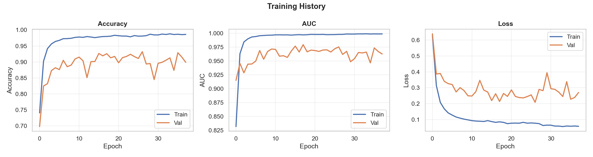
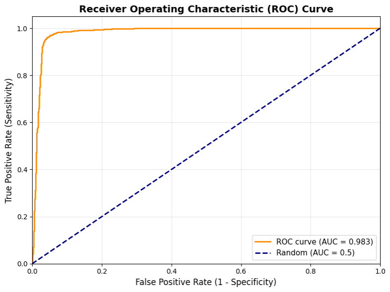
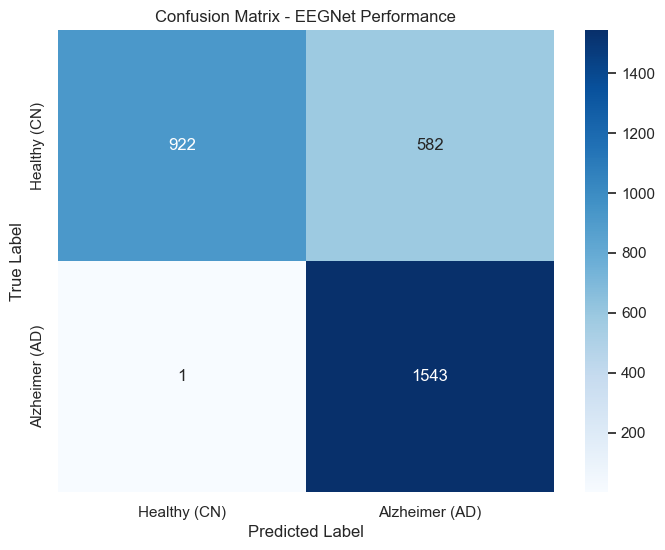

# EEG Alzheimer's Detection System

An end-to-end deep learning system for classifying Alzheimer's Disease (AD) vs Healthy Controls (CN) using EEG signals. Built with EEGNet, the system achieves **80.9% accuracy** and **0.983 AUC** on OpenNeuro ds004504 data.

## Project Overview

| Component | Description |
|---|---|
| **Task** | Binary classification: Alzheimer's (AD) vs Healthy Control (CN) |
| **Model** | EEGNet (Lawhern et al., 2018) — ~7K parameters |
| **Input** | 19-channel EEG, 2-second epochs @ 500 Hz |
| **Performance** | 80.9% accuracy, 0.983 AUC, 98.3% ROC-AUC |
| **Data** | OpenNeuro ds004504 — 30 subjects (15 AD + 15 CN) |

## Pipeline

### 1. Data Preprocessing (`notebooks/1_data_preprocessing.ipynb`)
- Load raw `.set` files and select 19 standard 10-20 channels
- FIR bandpass filter (0.5–45 Hz, zero-phase)
- Common Average Reference (CAR) re-referencing
- ICA artifact removal (EOG detection / variance threshold)
- Fixed-length epoching (2s windows, 50% overlap)

| EEG قبل المعالجه (Before) | EEG بعد المعالج (After) |
|:---:|:---:|
|  |  |

### 2. Model Training (`notebooks/2_training_pipeline1.ipynb`)
- Subject-level stratified 70/15/15 train/val/test split (no data leakage)
- Z-score normalization computed on training set only
- EEGNet architecture: Conv2D + DepthwiseConv2D + SeparableConv2D
- Adam optimizer (lr=0.001), binary crossentropy loss
- EarlyStopping (patience=20) + ReduceLROnPlateau (patience=10)
- Model saved as `.keras` with weights

### 3. Inference API (`server_fixed.py`)
- Flask REST API serving the trained model
- Accepts `.set` (raw EEG) or `.npy` (preprocessed) files
- Full preprocessing pipeline applied on upload
- Returns diagnosis, confidence probability, and EEG data for visualization

### 4. Frontend (`frontend/`)
- React + TypeScript + Vite + Tailwind CSS
- Patient information form → EEG file upload → Real-time results
- Displays diagnosis, confidence score, and EEG signal visualization

## Repository Structure

```
EEG-pro-Alzheimer-3/
├── notebooks/
│   ├── 1_data_preprocessing.ipynb   # Data preprocessing pipeline
│   └── 2_training_pipeline1.ipynb   # Model training & evaluation
├── models/
│   ├── eegnet_acc0.809_auc0.983_*.keras          # Trained model
│   └── eegnet_acc0.809_auc0.983_*_weights.h5     # Model weights
├── data/
│   ├── raw/                         # Raw EEG .set files (OpenNeuro)
│   ├── processed/                   # Preprocessed numpy arrays
│   └── new_subjects/                # Additional subject data
├── frontend/
│   ├── src/                         # React app source
│   ├── dist/                        # Built frontend
│   └── package.json
├── server_fixed.py                  # Flask inference server
├── requirements.txt                 # Python dependencies
└── start.sh                         # Launch script
```

## Setup & Usage

### Backend

```bash
# Create virtual environment
python -m venv .venv
source .venv/bin/activate

# Install dependencies
pip install -r requirements.txt

# Start the API server
python server_fixed.py
```

### Frontend

```bash
cd frontend
npm install
npm run dev
```

The server runs on `http://localhost:8000` and the frontend on `http://localhost:5173`.

## Model Architecture (EEGNet)

| Layer | Type | Output Shape | Parameters |
|---|---|---|---|
| Input | — | (19, 1000, 1) | 0 |
| Block 1 | Conv2D + BatchNorm + ELU | (19, 1000, 8) | 520 |
| Block 2 | DepthwiseConv2D + BatchNorm + ELU + AvgPool + Dropout | (1, 250, 16) | 2,448 |
| Block 3 | SeparableConv2D + BatchNorm + ELU + AvgPool + Dropout | (1, 62, 16) | 4,176 |
| Output | Flatten + Dense (sigmoid) | 1 | 993 |

## Results

| Metric | Value |
|---|---|
| Test Accuracy | 80.9% |
| Test AUC | 0.983 |
| Model Size | ~90 KB |
| Train/Val/Test Subjects | 21 / 5 / 4 |

### Training Performance



### ROC Curve & Confusion Matrix

 | 
:---: | :---:
**ROC Curve (AUC = 0.983)** | **Confusion Matrix**

The dataset is sourced from [OpenNeuro ds004504](https://openneuro.org/datasets/ds004504), consisting of resting-state EEG recordings from Alzheimer's patients and healthy controls.

## License

MIT
